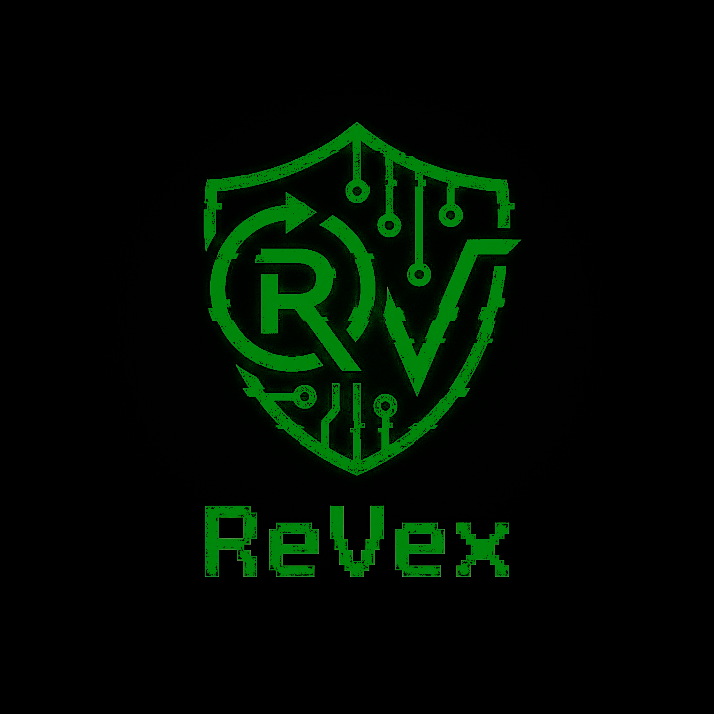

<p align="center">
  
</p>

<h1 align="center">ReVex</h1>

<p align="center">
  <strong>Browser-based HTTP Repeater for Security Researchers</strong>
</p>

<p align="center">
  <a href="https://addons.mozilla.org/en-US/firefox/addon/revex-hacker-s-http-repeater/">
    
  </a>
</p>

<p align="center">
  <a href="#features">Features</a> •
  <a href="#installation">Installation</a> •
  <a href="#usage">Usage</a> •
  <a href="#screenshots">Screenshots</a> •
  <a href="#support">Support</a>
</p>

---

## 📸 Screenshots

<p align="center">
  
</p>

---

## 🔥 What is ReVex?

ReVex is a powerful Firefox DevTools extension that brings **Burp Suite Repeater-like functionality** directly into your browser. Capture, modify, and replay HTTP requests without leaving your DevTools — perfect for penetration testers, bug bounty hunters, and security researchers.

## ✨ Features

### Core Functionality
- 📡 **Request Capture** — Automatically captures all HTTP requests from the current tab
- ✏️ **Request Editor** — Modify method, URL, headers, and body before resending
- 🔁 **HTTP Repeater** — Replay modified requests and analyze responses
- 📜 **Request History** — Browse and select from captured requests

### Power User Features
- 🔗 **Copy as cURL** — Generate valid bash cURL commands with proper escaping
- 🔓 **Magic Decoder** — Auto-detect and decode Base64, URL-encoded, JWT, and Hex strings
- 🔍 **Deep Search** — Real-time search with match highlighting and navigation
- 💅 **JSON Prettify** — One-click formatting for JSON payloads
- 👁️ **Response Preview** — Render HTML responses in a safe iframe

### UI/UX
- 🎨 **Cyberpunk Theme** — Sleek dark interface with neon green accents
- 📑 **Tabbed Interface** — Separate Request and Response views (Burp Suite style)
- ⌨️ **Keyboard Shortcuts** — Ctrl+Enter to send requests
- 🔔 **Toast Notifications** — Visual feedback for actions

## 🚀 Installation

### From Firefox Add-ons (Recommended)

<p align="center">
  <a href="https://addons.mozilla.org/en-US/firefox/addon/revex-hacker-s-http-repeater/">
    
  </a>
</p>

### Manual Installation (Developer Mode)

1. **Clone or download** this repository
   ```bash
   git clone https://github.com/medjahdi/ReVex.git
   ```

2. Open Firefox and navigate to `about:debugging`

3. Click **"This Firefox"** in the sidebar

4. Click **"Load Temporary Add-on..."**

5. Select the `manifest.json` file from the ReVex folder

6. Open **DevTools** (F12) and look for the **ReVex** tab!

## 📖 Usage

### Basic Workflow

1. **Open DevTools** (F12) and click on the **ReVex** tab
2. **Browse the web** — Requests are automatically captured in the History panel
3. **Click a request** to load it into the editor
4. **Modify** the method, URL, headers, or body as needed
5. **Click SEND** (or press Ctrl+Enter) to replay the request
6. **Analyze** the response in the Response tab

### Keyboard Shortcuts

| Shortcut | Action |
|----------|--------|
| `Ctrl + Enter` | Send request |
| `Escape` | Close decode modal |

### Magic Decoder

1. **Select text** in the response body
2. Click the **◈ DECODE** button
3. ReVex auto-detects the encoding format:
   - **JWT** — Decodes header and payload
   - **Base64** — Decodes to plain text
   - **URL Encoded** — Decodes %XX sequences
   - **Hex** — Converts hex to ASCII

### Copy as cURL

Click the **⌘ cURL** button to copy a valid bash command with:
- Proper single-quote escaping
- All headers included
- Request body (for POST/PUT)

## 🛡️ Permissions

ReVex requires the following permissions:

| Permission | Purpose |
|------------|---------|
| `webRequest` | Capture HTTP requests |
| `webRequestBlocking` | Intercept request details |
| `activeTab` | Access current tab's requests |
| `<all_urls>` | Send requests to any domain (for the Repeater) |

## 🏗️ Project Structure

```
ReVex/
├── manifest.json          # Extension manifest (MV3)
├── background.js          # Request capture & relay service
├── logo.png               # Extension icon
├── screenshot.png         # Extension screenshot
├── devtools/
│   ├── devtools.html      # DevTools page loader
│   └── devtools.js        # Panel initialization
├── panel/
│   ├── panel.html         # Main UI structure
│   ├── panel.css          # Cyberpunk styling
│   └── panel.js           # UI logic & features
└── .github/
    └── FUNDING.yml        # Sponsor configuration
```

## 💚 Support the Project

If ReVex helps with your security research, consider supporting development:

<p align="center">
  <a href="https://www.paypal.com/ncp/payment/KRJ9SS2HJM57J">
    
  </a>
</p>

## 🤝 Contributing

Contributions are welcome! Feel free to:

- 🐛 Report bugs
- 💡 Suggest features
- 🔧 Submit pull requests

## 📄 License

This project is open source and available under the [MIT License](LICENSE).

---

<p align="center">
  Built with ☠️ by <a href="https://github.com/medjahdi">@medjahdi</a>
</p>
